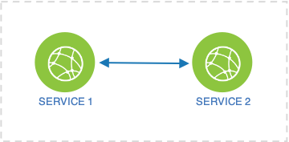

## Application Service Network Examples using Open-Horizon/IEAM 
These examples illustrate various application service networks that can be configured using capabilities available in Open-Horizon/IEAM for `edge device` nodes They show how two (or more) services can be configured differently to meet the requirements of different applications.

### 1. First example service (service1)
service1 to be used in various examples.

### 2. Second example service (service2)
service2 to be used in various examples.

### 3. Peer services (service-peer)
Two services are configured such that they are peer to each other and can access each other by their `service-name` alias. This configuration can be extended for more than two services. For this configuration to work each service is deployed separately and then another service (called service-peer in this example) configures them together. 

Service 1 and Service 2 can access each other. 

### 4. Required services (service-required)
Two services are configured such that upper level service has a lower dependent service, Deploying upper level service causes dependent lower service to be deployed automatically. This is implemented using `requiredServices` technique. Mutiple services can be configured similarly as dependent service of upper level service. 

Service 1 has access to Service 2 but Service 2 does not have access to Service 1 . ***( This limitation is being revised )***

### 5. Network host services (service-network-host)
In this configuration services can access each other using host network. Services are accessible externally as well. This requires privilege access.

Service 1 and 2 can access each other using host network. External user can access Service 1 and Service 2 independently as well 

## Next  
[Build and publish services in your IEAM envronment](https://github.com/edgedock/example/blob/master/network/publish)

